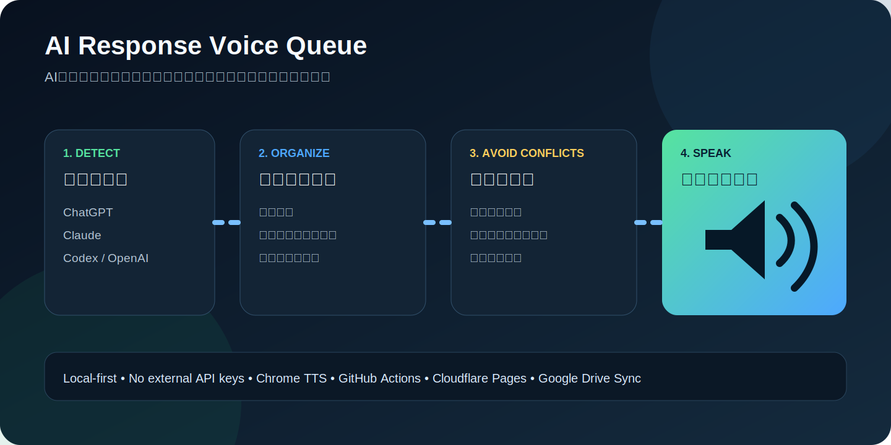
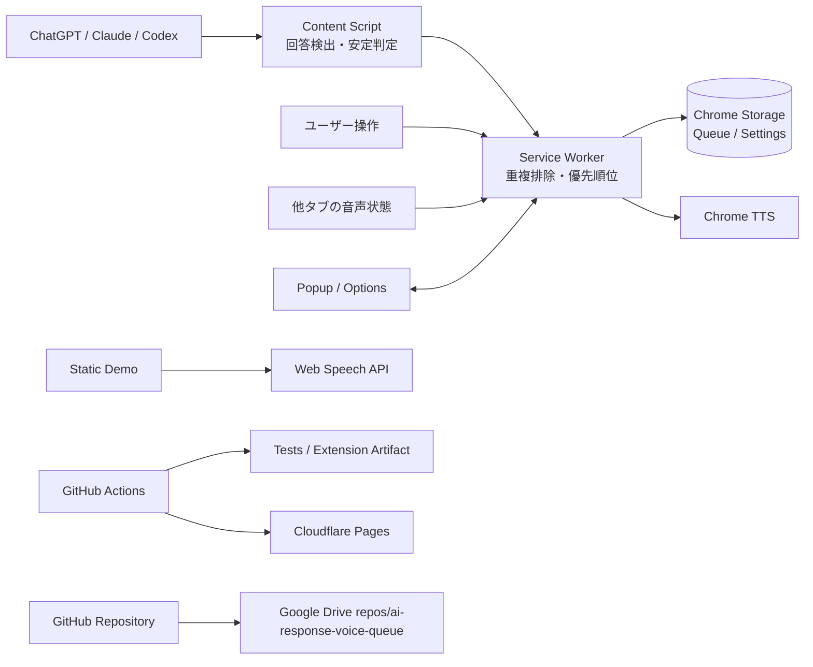

# AI Response Voice Queue



ChatGPT、Claude、Codex / OpenAI 系ページで新しく完成した回答を検出し、**見落とさないように順番を整理して自動読み上げする Chrome 拡張機能**です。

複数タブで回答が同時に返ってきても、重複を除外して一つのキューへ集約します。利用者が入力中のとき、別タブで音声が再生されているとき、すでに読み上げ中のときは待機し、競合が解消してから次の回答を読み上げます。

## 公開デモ

**https://ai-response-voice-queue.pages.dev**

デモでは、回答キュー、優先順位、操作中の待機、Web Speech API による読み上げをブラウザ上で体験できます。

## 主な機能

- ChatGPT / Claude / OpenAI・Codex系画面の回答を MutationObserver で検出
- ストリーミング中の文章が安定してからキューへ追加
- URL・Markdown・長いコードブロックを読み上げ向けに整形
- タブ横断の重複排除と優先順位付け
- キーボード入力や操作直後は読み上げを保留
- 他タブが音声再生中なら自動待機
- Chrome TTS による逐次読み上げ、停止、一時停止、手動「次を読む」
- ポップアップと詳細設定画面
- GitHub Actions でテスト、構文検査、拡張機能パッケージ生成
- GitHub 全ファイルを Google Drive `repos/ai-response-voice-queue` へ完全同期

## Chrome 拡張として使う

1. [GitHub Actions](https://github.com/univcorp2-ctrl/ai-response-voice-queue/actions) の最新成功 run を開きます。
2. `ai-response-voice-queue-extension` artifact を取得して展開します。
3. Chrome で `chrome://extensions` を開きます。
4. 「デベロッパー モード」を有効にします。
5. 「パッケージ化されていない拡張機能を読み込む」から展開した `dist` フォルダを選びます。
6. ChatGPT または Claude を開き、拡張機能ポップアップで「自動読み上げ」を有効にします。

詳細は [docs/setup.md](docs/setup.md) を参照してください。

## 読み上げ判断

1. 回答 DOM のテキストが一定時間変化しないことを確認
2. 同一内容の fingerprint が最近処理済みでないか確認
3. 利用者が入力・クリック・スクロール中なら待機
4. 他タブが `audible` の場合は待機
5. 現在アクティブなタブ、回答時刻、待機時間から優先度を計算
6. Chrome TTS で一件ずつ読み上げ
7. 完了後に間隔を空けて次の回答へ進む

## アーキテクチャ



詳しい責務分担は [docs/architecture.md](docs/architecture.md) にあります。

## 開発

```bash
npm ci
npm run lint
npm test
npm run build
npm run build:web
```

生成物:

- `dist/`: Chrome に読み込む拡張機能
- `web-dist/`: Cloudflare Pages 用デモ

## 対応範囲と制約

DOM 構造は各サービス側の更新で変わる可能性があります。検出処理は複数 selector とフォールバックを持ちますが、サイト更新時は `src/content.js` の selector を調整してください。

ブラウザのプライバシー制約上、OS 全体の会議・通話・マイク利用状況は取得しません。代わりに、対応ページでの利用者操作と Chrome が公開するタブの `audible` 状態を使い、作業や音声との衝突を減らします。回答本文は外部サーバーへ送信せず、ブラウザ内だけで処理します。

## セキュリティ

- 外部 API キー不要
- 回答本文の外部送信なし
- 保存対象は設定、待機中キュー、短い重複判定 fingerprint
- 権限は `storage`、`tts`、`tabs` と対応サイトへの host permission に限定

## ライセンス

MIT License
