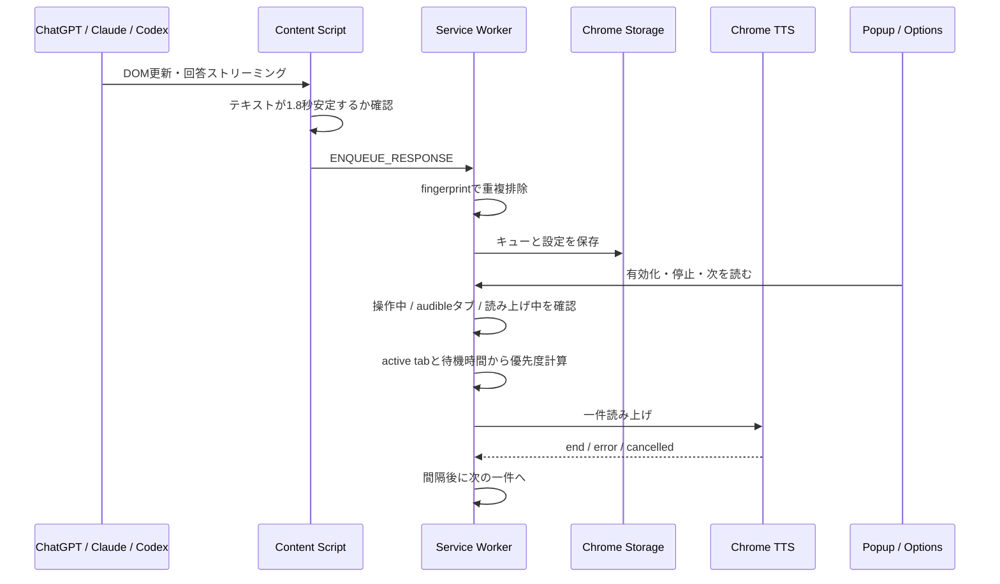

# Architecture

## 全体像

AI Response Voice Queue は Chrome Manifest V3 拡張と、動作を体験する静的 Web デモで構成されます。回答本文はブラウザ外へ送信しません。

## コンポーネント

### Content Script

`src/content.js` は対応サイトの DOM を監視します。回答候補のテキストが変化しなくなってから service worker へ渡すため、ストリーミング途中の断片を読み上げません。キー入力、クリック、ホイール操作も低頻度で通知します。

### Queue Core

`src/core/queue.js` は Chrome API に依存しない純粋関数です。正規化、FNV-1a fingerprint、読み上げ用 Markdown 整形、優先度計算を担当し、Node.js の組み込み test runner で検証します。

### Service Worker

`src/background.js` がタブ横断の中心です。キュー、最近処理した fingerprint、設定、最終操作時刻を `chrome.storage.local` に保存します。サービスワーカーが停止・再起動しても待機中キューを復元できます。

優先度は以下を加点します。

- 現在アクティブなタブ
- 最後に操作した対応サイトのタブ
- 長く待っている回答
- 将来の高優先度フラグ

### Conflict Avoidance

利用者操作直後は設定時間だけ待機します。`chrome.tabs.query({ audible: true })` で音声再生中タブがある場合も再試行します。OS 全体のマイクや会議状態は権限とプライバシー上取得しません。

### UI

Popup はキュー数、有効状態、読み上げ状態、手動操作を提供します。Options は音声、速度、音量、最大文字数、待機時間を保存します。

### Web Demo

`web/` は拡張機能の判断を簡略化した公開デモです。Web Speech API を使用し、Cloudflare Pages にデプロイされます。本番拡張の Chrome TTS と完全に同一ではありませんが、キュー体験を確認できます。

## CI/CD

GitHub Actions は push、pull request、手動実行で次を行います。

1. JavaScript 構文検査
2. queue core の単体テスト
3. `dist/` 拡張機能ビルド
4. `web-dist/` デモビルド
5. 両方を artifact として保存

Cloudflare Pages は `npm run build:web` の `web-dist` を公開します。GitHub の全ファイルは Google Drive の `repos/ai-response-voice-queue` に完全同期します。

## 拡張案

- Edge Add-ons / Chrome Web Store 公開
- サイトごとの selector 自動診断
- 通知センターと読み上げ履歴
- 重要語、プロジェクト名、質問タブによる priority rule
- オフスクリーン document を使った追加音声エンジン
- 利用者が明示した場合だけ使うローカル要約モデル
